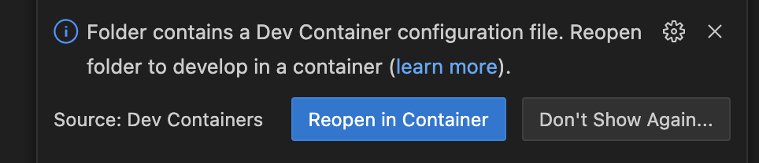

# ZKFocil with Barretenberg

ZKFocil circuit is written with the standard library in barretenberg. The circuit specification is described [here](https://hackmd.io/qRtuRAD3Q4KeXZr8TxvUng?view#SNARK-Design-for-zkFOCIL). In this implementation, we test and benchmark the circuit with BN254 and SECP256K1 keys. Ethereum validator keys are on BLS381-12 but BLS is not supported in barretenberg's stdlib. Note that we use BN254 as the base curve of the ZKFocil circuit.

We use the Ultra Honk proof system in barretenberg to generate proofs for the zkFOCIL circuit. We test the circuit with two different univariate polynomial commitment schemes:

1. KZG (Kate-Zaverucha-Goldberg): Requires a one-time trusted setup.
2. IPA (Inner Product Argument): No trusted setup is required.

The branch `bberg-zkfocil-kzg` contains the implementation of zkFOCIL circuit with KZG polynomial commitment scheme. The branch `bberg-zkfocil-ipa` contains the implementation of zkFOCIL circuit with IPA polynomial commitment scheme.

### Running the zkFOCIL circuit with KZG backend

The zkFOCIL circuit is implemented in a fork of the original [aztec-packages](https://github.com/AztecProtocol/aztec-packages) repository.
Installing barretenberg and running the benchmarks requires a few steps. It is recommended to use a Linux environment for building and running the benchmarks. The following instructions will guide you through the process.

- Clone the [zkFOCIL](https://github.com/shreyas-londhe/zkFOCIL-impl) repository and switch the `bberg-zkfocil-kzg` branch.

  ```bash
  # Clone the repository
  git clone https://github.com/shreyas-londhe/zkFOCIL-impl

  # Switch to the bberg-zkfocil-kzg branch
  cd zkFOCIL-impl
  git checkout bberg-zkfocil-kzg
  ```

- Open the zkFOCIL repository in VSCode and install the recommended extensions. This will help you with syntax highlighting, code formatting, and other development features.
- On opening the repository in VSCode, you should see a notification in the bottom right corner of VSCode prompting you reopen the folder in a container. Click on "Reopen in Container" to set up the development environment with all the necessary dependencies and tools.

  

- If you don't see the notification, you can manually open the command palette (`Ctrl + Shift + P`) and select "Remote-Containers: Reopen in Container". This will set up the development environment with all the necessary dependencies and tools.
- Once the container is set up, you must first download the SRS required to run KZG prover in barretenberg. The SRS is a large file, so it may take some time to download.

  ```bash
  # Download the SRS file
  cd barretenberg/cpp
  (cd srs_db && ./download_ignition.sh 3) # don't forget the parentheses, it just runs the command in a subshell
  ```

- You can now run the zkFOCIL tests and benchmarks. To run the tests, run the following commands:

  ```bash
  # Use the default preset to build the project
  cmake --preset default

  # Run tests of the ZKFocil circuit
  # This will only build and run the tests for the ZKFocil circuit and not the whole of barretenberg. Building the whole of barretenberg can take a _very_ long time.
  cmake --build --preset default --target stdlib_zkfocil_tests && (cd build && ./bin/stdlib_zkfocil_tests)
  ```

- To run the benchmarks, use the following command:

  ```bash
  # Use the bench preset to build the project for benchmarking
  cmake --preset bench

  # Run prover benchmark for the ZKFocil circuit
  cmake --build --preset bench --target ultra_honk_bench && (cd build-bench && ./bin/ultra_honk_bench --benchmark_filter=zkfocil)
  ```

### Benchmarking Results

Machine 1: 2x AMD EPYC 7R13 (48C/96T each, 192 logical CPUs total)

| Stage                   | bn254-kzg | secp256k1-kzg | bn254-ipa | secp256k1-ipa |
| ----------------------- | --------- | ------------- | --------- | ------------- |
| Num of gates            | 111227    | 110946        | 111227    | 110946        |
| Witness Generation (ms) | 835       | 844           | 800       | 818           |
| Proof Generation (ms)   | 387       | 384           | 1596      | 1663          |
| Verification (ms)       | 8.839     | 9.771         | 48.3      | 45.9          |
| Proof size (bytes)      | 440       | 440           | 586       | 586           |

Machine 2: GCP e2-standard-16 (16vCPU (8 core), 64 GB memory)

| Stage                   | bn254-kzg | secp256k1-kzg | bn254-ipa | secp256k1-ipa |
| ----------------------- | --------- | ------------- | --------- | ------------- |
| Num of gates            | 111227    | 110946        | 111227    | 110946        |
| Witness Generation (ms) | 1129      | 1167          | -         | -             |
| Proof Generation (ms)   | 807       | 838           | -         | -             |
| Verification (ms)       | 12.75     | 15.47         | -         | -             |
| Proof size (bytes)      | 440       | 440           | 586       | 586           |
